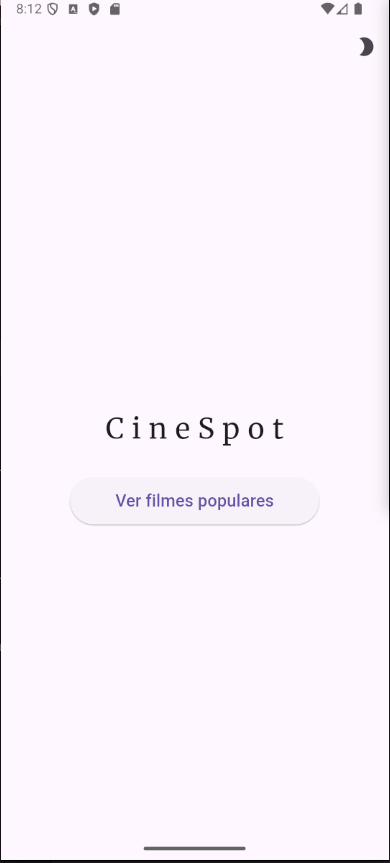
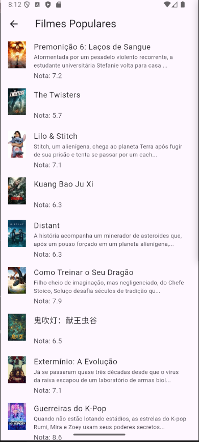
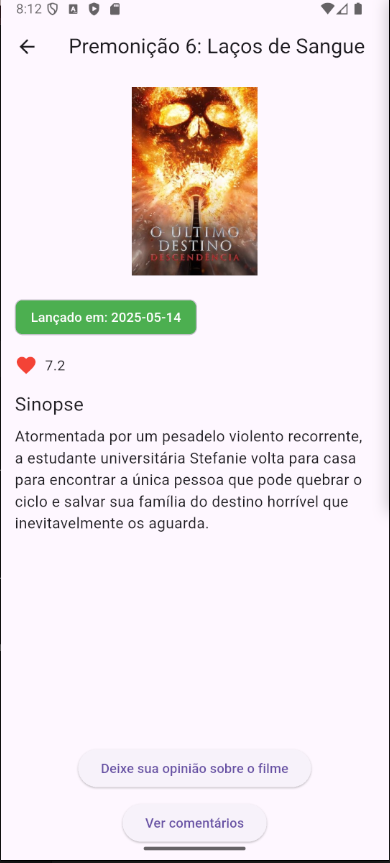

# 🎬 CineSpot

Aplicativo Flutter desenvolvido como Trabalho Prático 3 da disciplina de Programação Para Dispositivos Móveis.  
O **CineSpot** permite listar filmes, visualizar detalhes e gerenciar comentários locais sobre cada filme.

## 📱 Funcionalidades

✅ Listagem de filmes com informações básicas  
✅ Visualização de detalhes do filme (título, sinopse, data, avaliação)  
✅ Sistema de comentários para cada filme  
✅ Avaliação dos filmes (nota e texto do comentário)  
✅ Tema claro/escuro com alternância pelo usuário  
✅ Banco de dados local utilizando Drift

## 📸 Imagens do Aplicativo

| Página Home           | Lista de Filmes        | Detalhes do Filme      | Dialog Comentário        | Tela de Comentários      |
|-----------------------|-----------------------|-----------------------|-------------------------|-------------------------|
|  |  |  |  |  |

## ⚙️ Como executar

### 1. Clone o repositório para sua máquina
git clone https://github.com/seu-usuario/tp3.git

### 2. Acesse a pasta do projeto
cd tp3

### 3. Instale as dependências do Flutter
flutter pub get

### 4. Execute o app no dispositivo/emulador conectado
flutter run
